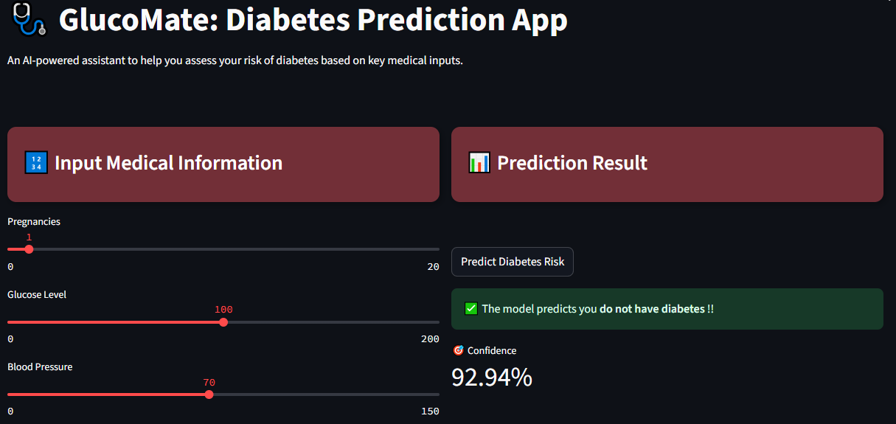

# 🩺 GlucoMate — AI-Powered Diabetes Risk Prediction App

**GlucoMate** is a Streamlit-based machine learning web application that predicts the likelihood of diabetes using medical data and provides AI-generated, personalized health tips.  
This project combines **machine learning**, **data preprocessing**, **model deployment**, and **generative AI** into a clean, user-friendly interface.

---

## 🚀 Features

### 🔢 Medical Data Input UI
Users can input the following health metrics:
- Pregnancies  
- Glucose  
- Blood Pressure  
- Skin Thickness  
- Insulin  
- BMI  
- Diabetes Pedigree Function  
- Age  

### 🧠 Machine Learning Prediction
- **Support Vector Machine (SVM)** classifier  
- Standardized input data using **StandardScaler**  
- Displays **prediction confidence**

### 🤖 AI-Generated Health Tips
- Personalized lifestyle and wellness tips  
- Generated using **Cohere AI**  
- Short, practical, and non-alarming advice

### 🌙 Modern Dark UI
- Sticky-note style cards  
- Clean two-column layout  
- User-friendly sliders and inputs  

---

## 🛠 Tech Stack

### Machine Learning
- Python  
- NumPy  
- Pandas  
- Scikit-learn  
- Support Vector Machine (SVM)

### Frontend & App
- Streamlit  
- Custom HTML/CSS styling  

### AI Integration
- Cohere API (**command-r** model)

---

## 📊 Model Details
- **Algorithm:** Support Vector Machine (SVM)  
- **Preprocessing:** StandardScaler  
- **Dataset:** PIMA Indians Diabetes Dataset  
- **Output:**
  - Binary classification (**Diabetic / Not Diabetic**)  
  - Prediction confidence score  

---

## 🧠 AI Health Tips Logic
After prediction, users can request AI-generated health tips:
- Based on the user’s medical input  
- Adjusted depending on prediction outcome  
- Focused on:
  - Blood sugar control  
  - Lifestyle improvements  
  - Diet and physical activity  

Tips are:
- Brief (**3–5 bullet points**)  
- Medically safe  
- Easy to understand  

---

## ⚠️ Disclaimer
This application is for educational purposes only.
It does not replace professional medical diagnosis or treatment.
Always consult a qualified healthcare provider.

---



---

## ▶️ How to Run the App

### 1) Install Dependencies
```bash
pip install streamlit numpy pandas scikit-learn cohere

 2) Add your Cohere API key in ai_helper.py:
import cohere
co = cohere.Client("YOUR_COHERE_API_KEY")

 3) Run the Streamlit App
streamlit run app.py


---


